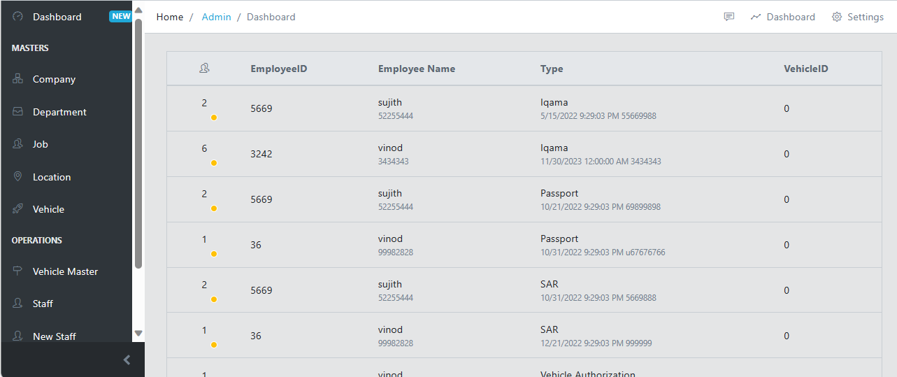
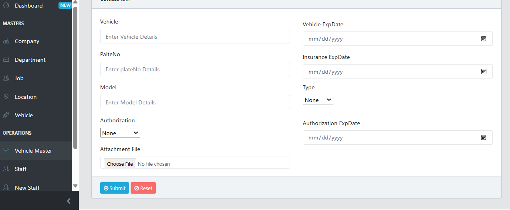
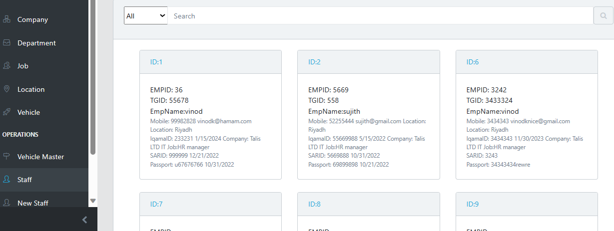
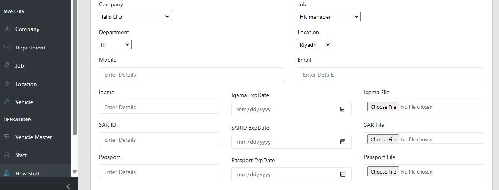
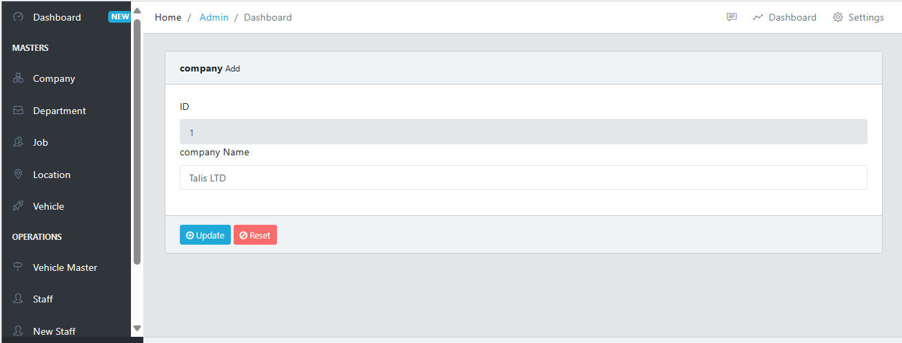

# Admin Web Core Razor
Boilerplate bootstrap admin template for `ASP.NET Core 7.0` for a Razor project.

The project is based on Razor [pages](https://docs.microsoft.com/en-us/aspnet/core/razor-pages/?view=aspnetcore-3.1&tabs=visual-studio). I have already fixed the solution to add `webapi` and document them with **Swagger**.

## Foldder structure

- **AdminWebCore** contains the web application. The sub-folders contain:
    - **Apis**: example of **ApiController** with comments to generate the XML for Swagger
    - **Pages**: all the pages for he web application in Razor format. Main file is _Index.cshtml_.
        - **Shared**: common files for the UI, for example _Layout.cshtml_. Allo other folders are example of pages
    - **wwwroot**: static files 
        - **CoreUI**: original files from the free template CoreUI

## About project

Operation Pro is web-based tracking the company staff's basic information and vehicle details.
Also, tracking some advance payments and expenses to the site.   

## Dependecies

- [CoreUI](https://github.com/coreui/coreui-free-bootstrap-admin-template) is free bootstrap admin template
- [NSwag.AspNetCore](https://github.com/RicoSuter/NSwag) to add Swagger to this project (_Startup.cs_ is fixed accordingly). 

## Screenshots

### Dashboard

### vehicle

### StaffList

### Staff

### Swagger

